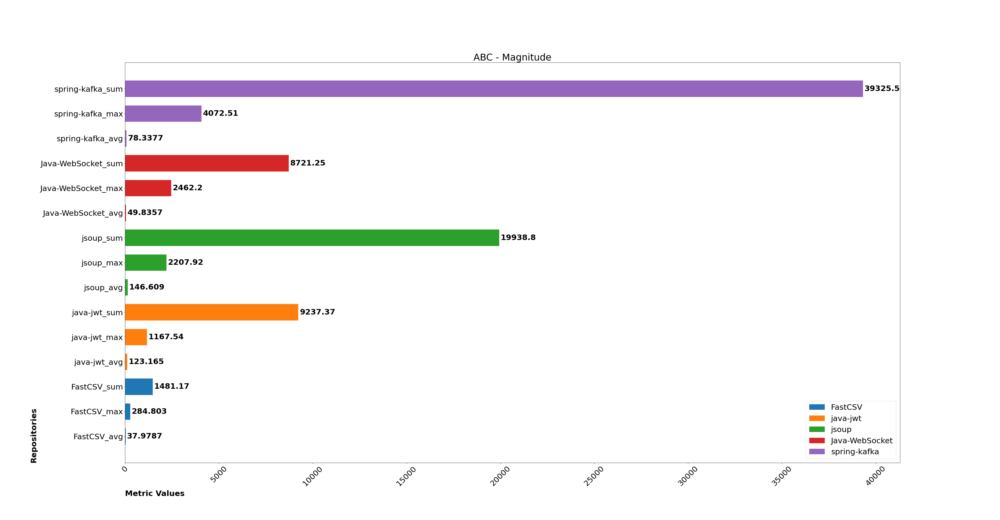
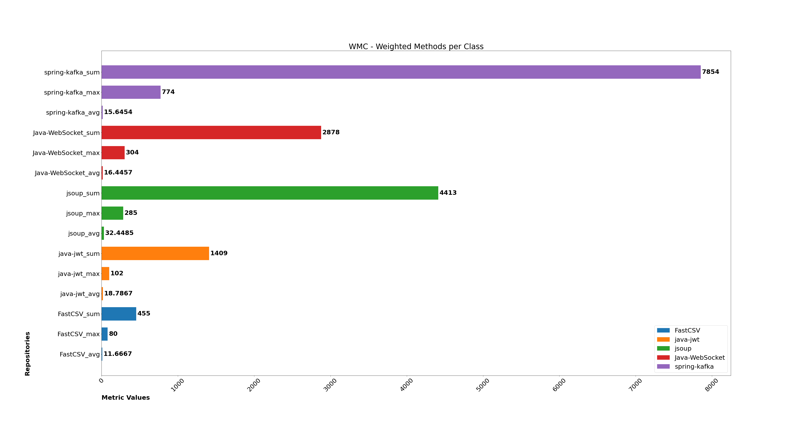
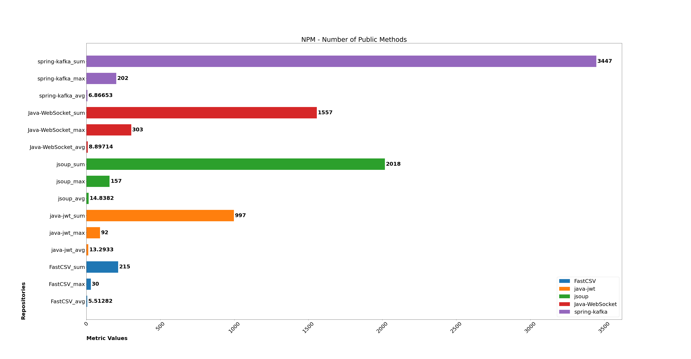
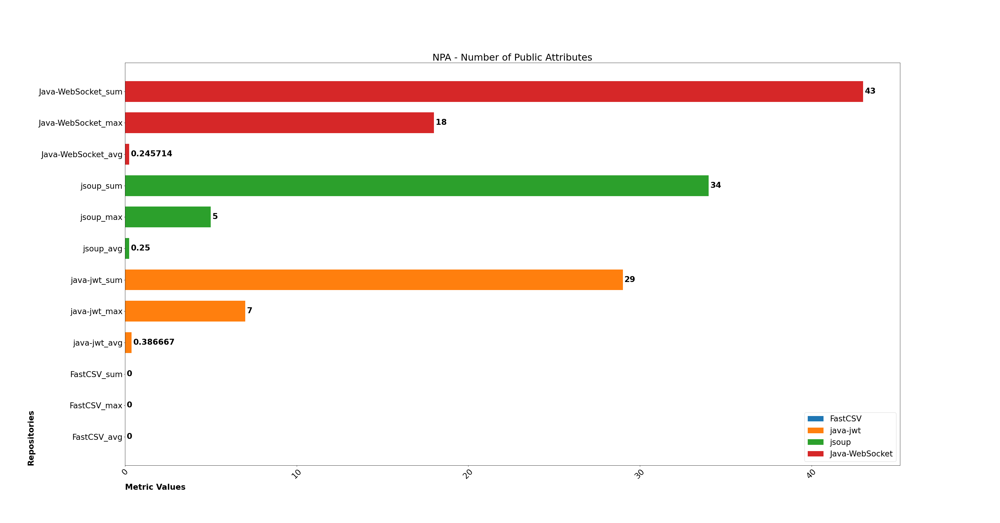
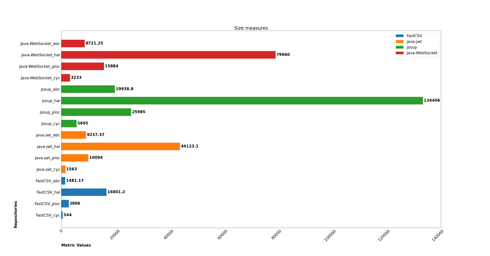
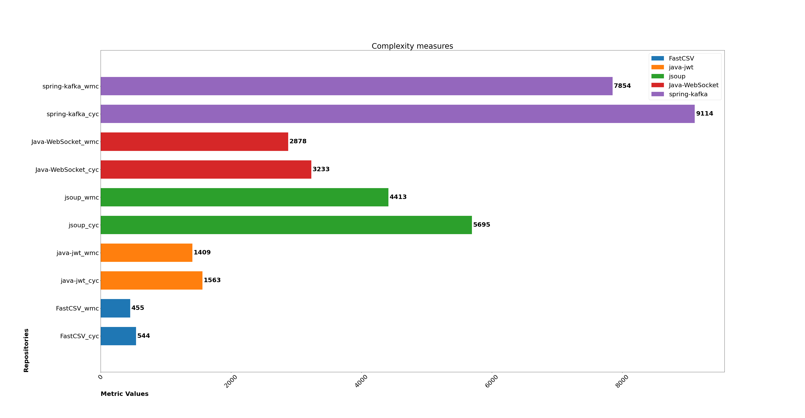
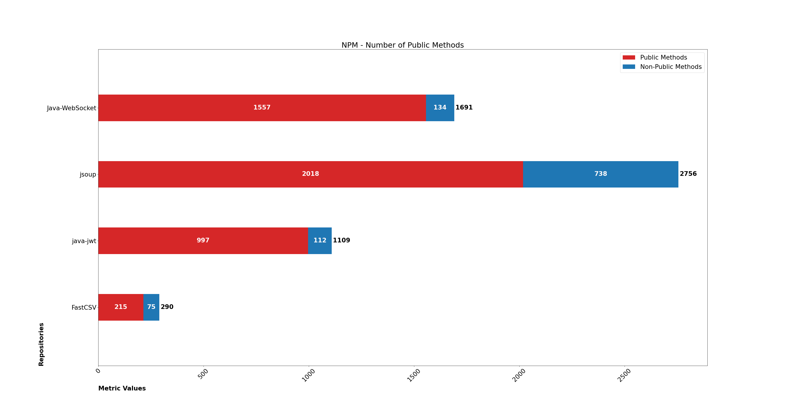
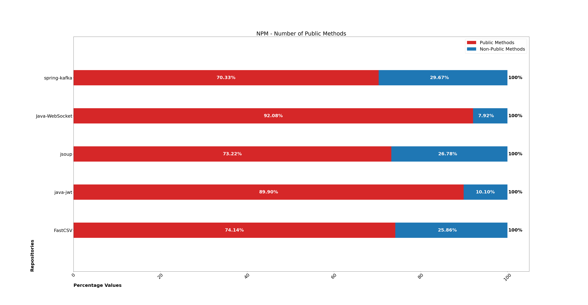
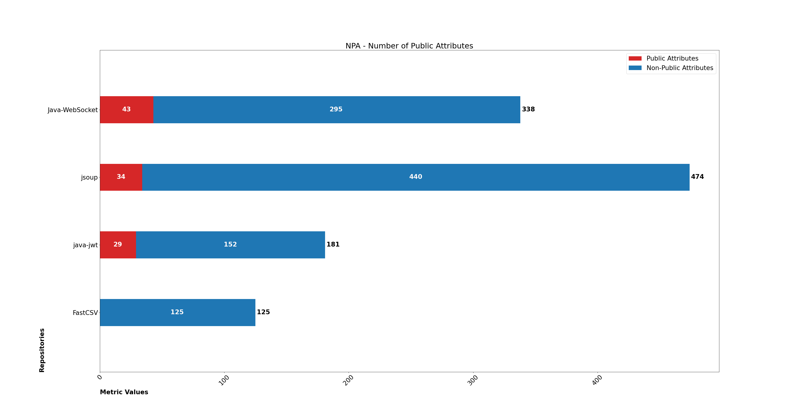
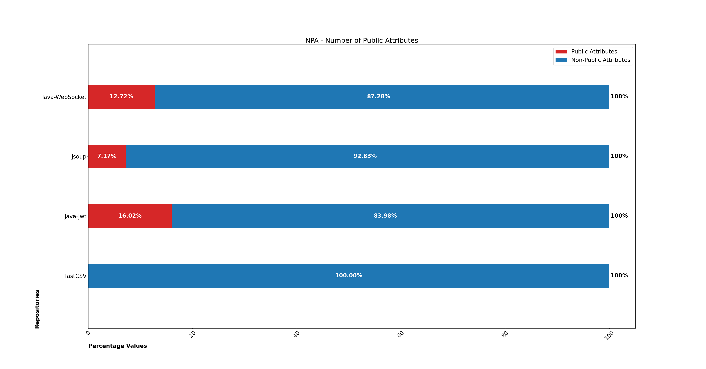

# Static Analysis

## Repositories
| Name | Version | Files | Source |
| --- | --- | --- | --- |
| [spring-kafka](https://github.com/spring-projects/spring-kafka) | v2.9.0 | 502 | [Maven Central](https://mvnrepository.com/artifact/org.springframework.kafka/spring-kafka) |
| [Java-WebSocket](https://github.com/TooTallNate/Java-WebSocket) | v1.5.3 | 175 | [Maven Central](https://mvnrepository.com/artifact/org.java-websocket/Java-WebSocket) |
| [jsoup](https://github.com/jhy/jsoup) | jsoup-1.15.2 | 136 | [Maven Central](https://mvnrepository.com/artifact/org.jsoup/jsoup) |
| [java-jwt](https://github.com/auth0/java-jwt) | 4.0.0 | 75 | [Maven Central](https://mvnrepository.com/artifact/com.auth0/java-jwt) |
| [FastCSV](https://github.com/osiegmar/FastCSV) | v2.2.0 | 39 | [Maven Central](https://mvnrepository.com/artifact/de.siegmar/fastcsv) |

## Graphs
- [Cumulative measures](#cumulative-measures)
    - [Magnitude (ABC)](#magnitude-abc)
    - [Weighted Methods per Class (WMC)](#weighted-methods-per-class-wmc)
    - [Number of Public Methods (NPM)](#number-of-public-methods-npm)
    - [Number of Public Attributes (NPA)](#number-of-public-attributes-npa)
- [Metric comparisons](#metric-comparisons)
    - [Size metrics](#size-metrics)
    - [Complexity metrics](#complexity-metrics)
- [Visibility measures](#visibility-measures)
    - [Methods](#methods)
    - [Percentage of methods](#percentages-of-methods)
    - [Attributes](#attributes)
    - [Percentage of attributes](#percentage-of-attributes)

### Cumulative measures
This kind of graph represents the sum, maximum and average cumulative measures for each repository.

#### Magnitude (ABC)
The objective of the graph is to show that the magnitude can be used to measure repositories size. The magnitude is often directly proportional to the number of source files in the repository.

#### Weighted Methods per Class (WMC)
The objective of the graph is to show that the WMC can be used to measure repositories complexity.

#### Number of Public Methods (NPM)
The objective of the graph is to show that the NPM can be used to measure repositories security.

#### Number of Public Attributes (NPA)
The objective of the graph is to show that the NPA can be used to measure repositories security.

### Metric comparisons
This kind of graph represent more than one metric for each repository.

#### Size metrics
The objective of the graph is to show that ABC magnitude, Halstead Estimated Program Length, PLOC and Cyclomatic Complexity metrics for a set of repositories provide similar repository size information.

#### Complexity metrics
The objective of the graph is to show that WMC and Cyclomatic Complexity metrics for a set of repositories provide similar repository complexity information.

### Visibility measures
This kind of graph represent public and non-public members for each repository.

#### Methods
The objective of the graph is to show how many public and non-public methods have been declared in repositories.

#### Percentages of methods
The objective of the graph is to show the percentages of public and non-public methods declared in repositories.

#### Attributes
The objective of the graph is to show how many public and non-public attributes have been declared in repositories.

#### Percentage of attributes
The objective of the graph is to show the percentages of public and non-public attributes declared in repositories.

