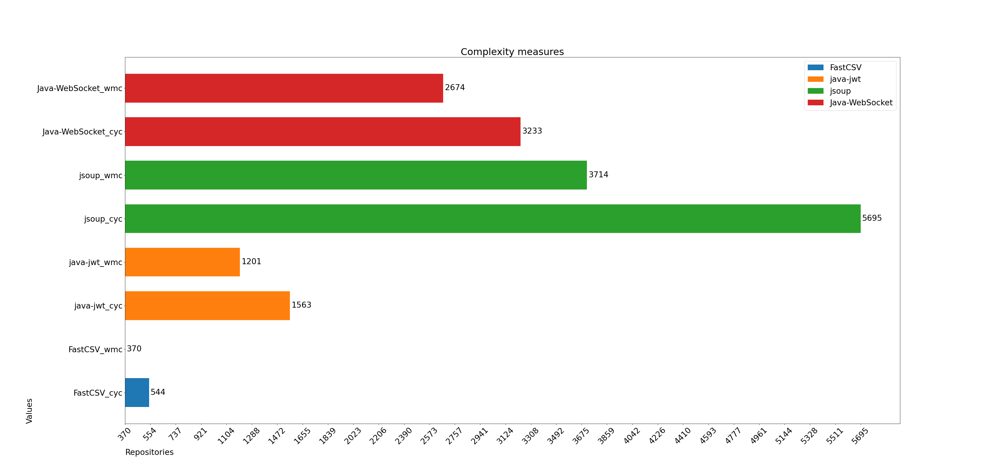

# static-analysis

## Graphs
- [Weighted Methods per Class (WMC)](#weighted-methods-per-class-wmc)
- [Magnitude (ABC)](#magnitude-abc)
- [Number of Public Methods (NPM)](#number-of-public-methods-npm)
- [Class Operation Accessibility (COA)](#class-operation-accessibility-coa)
- [Number of Public Attributes (NPA)](#number-of-public-attributes-npa)
- [Class Data Accessibility (CDA)](#class-data-accessibility-cda)
- [Size metrics comparison](#size-metrics-comparison)
- [Complexity metrics comparison](#complexity-metrics-comparison)

### Weighted Methods per Class (WMC)
Sum, minimum, maximum and average over a set of repository files.

### Magnitude (ABC)
Sum, minimum, maximum and average over a set of repository files.

### Number of Public Methods (NPM)
Sum, minimum, maximum and average over a set of repository files.

### Class Operation Accessibility (COA)
Sum, minimum, maximum and average over a set of repository files.

### Number of Public Attributes (NPA)
Sum, minimum, maximum and average over a set of repository files.

### Class Data Accessibility (CDA)
Sum, minimum, maximum and average over a set of repository files.

### Size metrics comparison
Compare ABC magnitude, Halstead estimated program length, PLOC and Cyclomatic Complexity metrics for a set of repositories.

### Complexity metrics comparison
Compare WMC and Cyclomatic Complexity metrics for a set of repositories.

