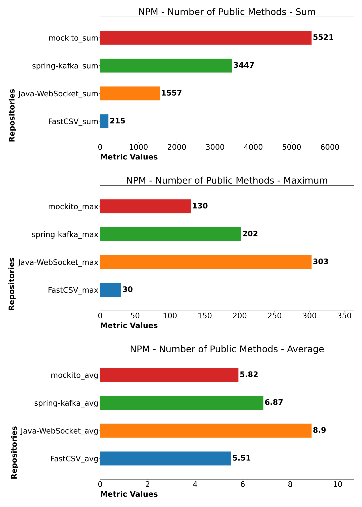
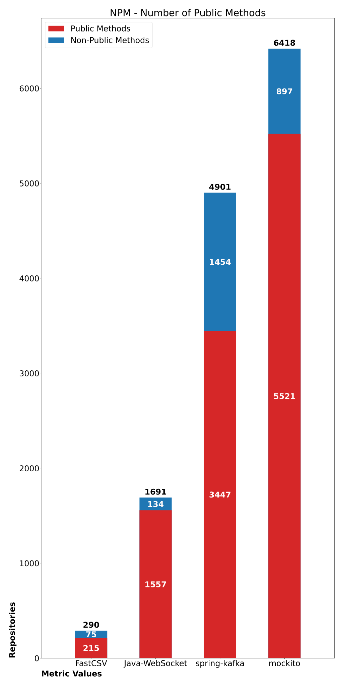

# Static Analysis

## Repositories
| Name | Size | Version | Java Files | Source |
| --- | --- | --- | --- | --- |
| [mockito](https://github.com/mockito/mockito) | Very Large | 4.7.0 | 949 | [Maven Central](https://mvnrepository.com/artifact/org.mockito/mockito-core) |
| [spring-kafka](https://github.com/spring-projects/spring-kafka) | Large | 2.9.0 | 502 | [Maven Central](https://mvnrepository.com/artifact/org.springframework.kafka/spring-kafka) |
| [Java-WebSocket](https://github.com/TooTallNate/Java-WebSocket) | Medium | 1.5.3 | 175 | [Maven Central](https://mvnrepository.com/artifact/org.java-websocket/Java-WebSocket) |
| [FastCSV](https://github.com/osiegmar/FastCSV) | Small |2.2.0 | 39 | [Maven Central](https://mvnrepository.com/artifact/de.siegmar/fastcsv) |

## Graphs
- [Cumulative measures](#cumulative-measures)
  - [Size and Complexity](#size-and-complexity)
  - [Visibility](#visibility)
- [Metric comparisons](#metric-comparisons)
  - [Size](#size)
  - [Complexity](#complexity)
- [Visibility measures](#visibility-measures)
  - [Measures](#measures)
  - [Percentages](#percentages)

### Cumulative measures
This kind of graph represents the sum, maximum and average cumulative measures for each repository.

#### Size and Complexity

<table width="100%">
  <tr>
    <td width="50%">Magnitude (ABC)</td>
    <td width="50%">Weighted Methods per Class (WMC)</td>
  </tr>
  <tr>
    <td width="50%">The objective of the graph is to show that the magnitude can be used to measure repositories size. The magnitude is often directly proportional to the number of source files in the repository.</td>
    <td width="50%">The objective of the graph is to show that the WMC can be used to measure repositories complexity.</td>
  </tr>
  <tr>
    <td width="50%">
        
    </td>
    <td width="50%">
        
    </td>
  </tr>
</table>

#### Visibility

<table>
  <tr>
    <td width="50%">Number of Public Methods (NPM)</td>
    <td width="50%">Number of Public Attributes (NPA)</td>
  </tr>
  <tr>
    <td width="50%">The objective of the graph is to show that the NPM can be used to measure repositories security.</td>
    <td width="50%">The objective of the graph is to show that the NPA can be used to measure repositories security.</td>
  </tr>
  <tr>
    <td width="50%">
        
    </td>
    <td width="50%">
        
    </td>
  </tr>
</table>

### Metric comparisons
This kind of graph represent more than one metric for each repository.

#### Size
The objective of the graph is to show that ABC magnitude, Halstead Estimated Program Length, PLOC and Cyclomatic Complexity metrics for a set of repositories provide similar repository size information.

#### Complexity
The objective of the graph is to show that WMC and Cyclomatic Complexity metrics for a set of repositories provide similar repository complexity information.

### Visibility measures
This kind of graph represent public and non-public methods and attributes for each repository.

#### Measures

The objective of the graph is to show how many public and non-public methods and attributes have been declared in the repositories.

<table width="100%">
  <tr>
    <td width="50%">Number of Methods</td>
    <td width="50%">Number of Attributes</td>
  </tr>
  <tr>
    <td width="50%">
        
    </td>
    <td width="50%">
        
    </td>
  </tr>
</table>

#### Percentages

The objective of the graph is to show the percentages of public and non-public methods and attributes declared in the repositories. 

<table width="100%">
  <tr>
    <td width="50%">Percentages of Methods</td>
    <td width="50%">Percentages of Attributes</td>
  </tr>
  <tr>
    <td width="50%">
        
    </td>
    <td width="50%">
        
    </td>
  </tr>
</table>