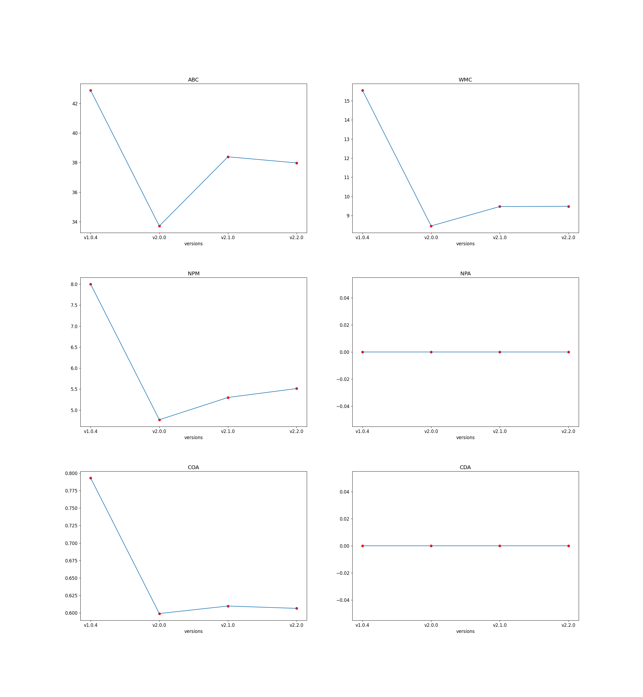
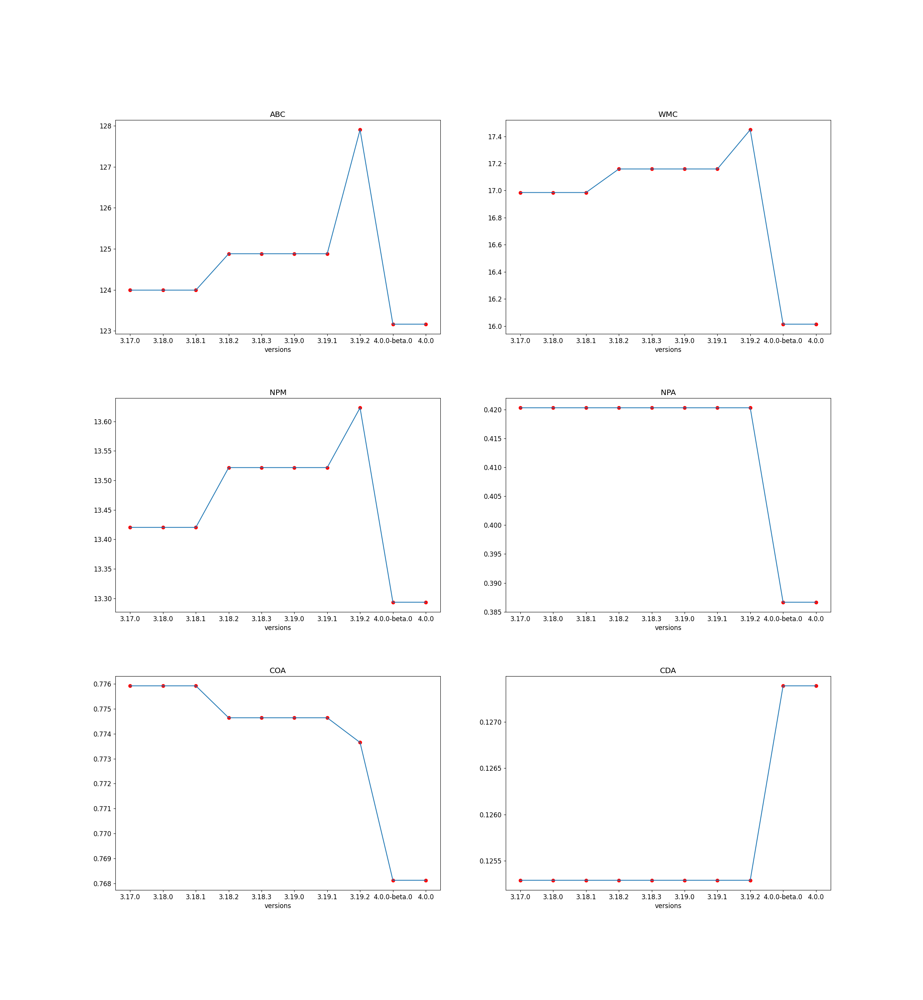
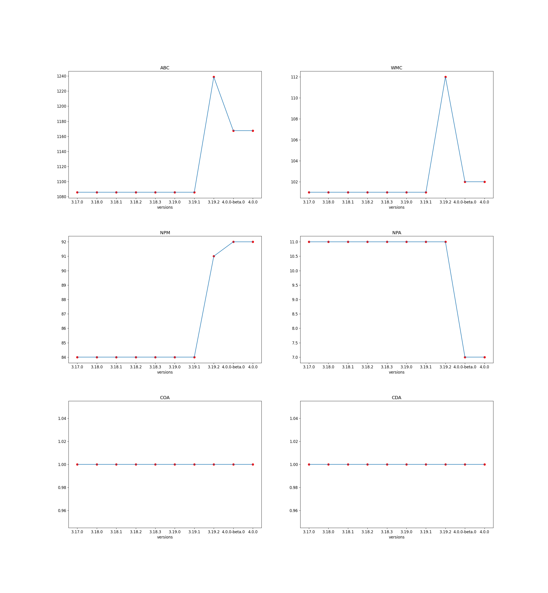
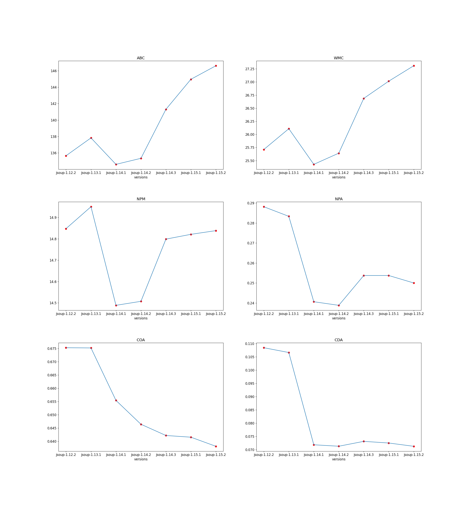
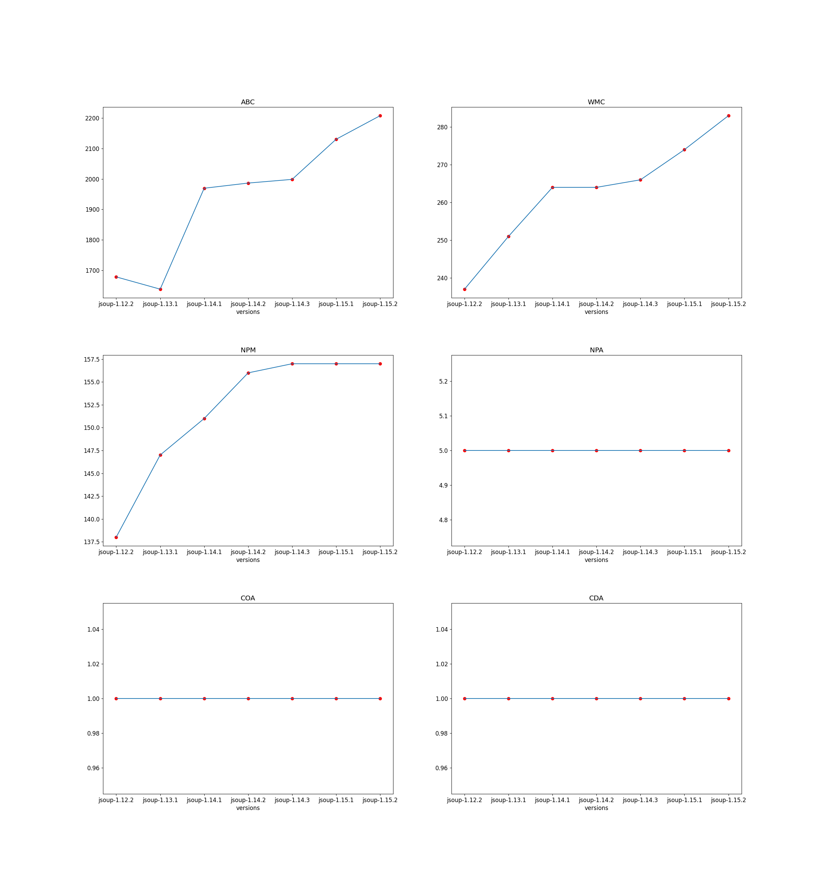
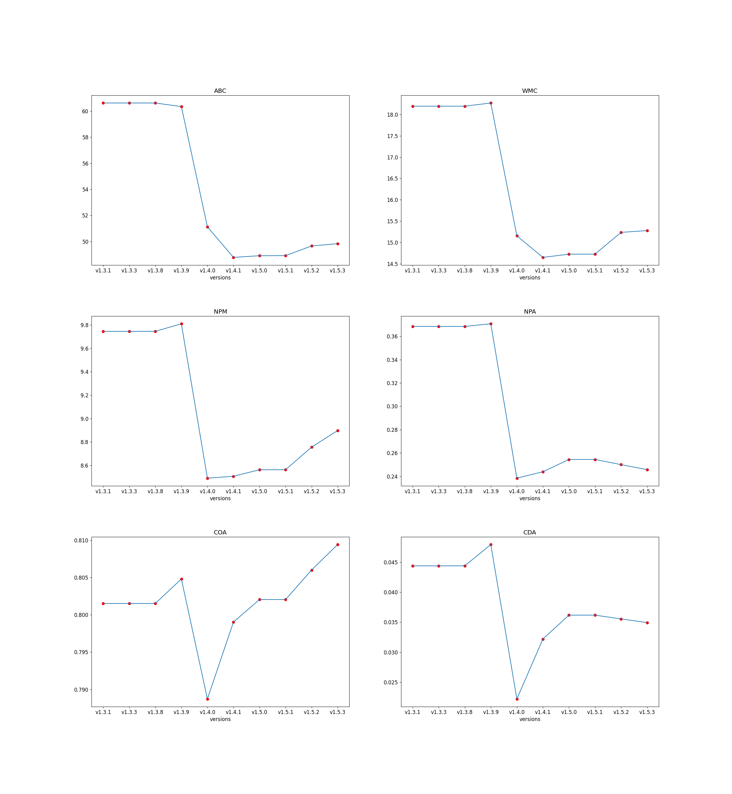
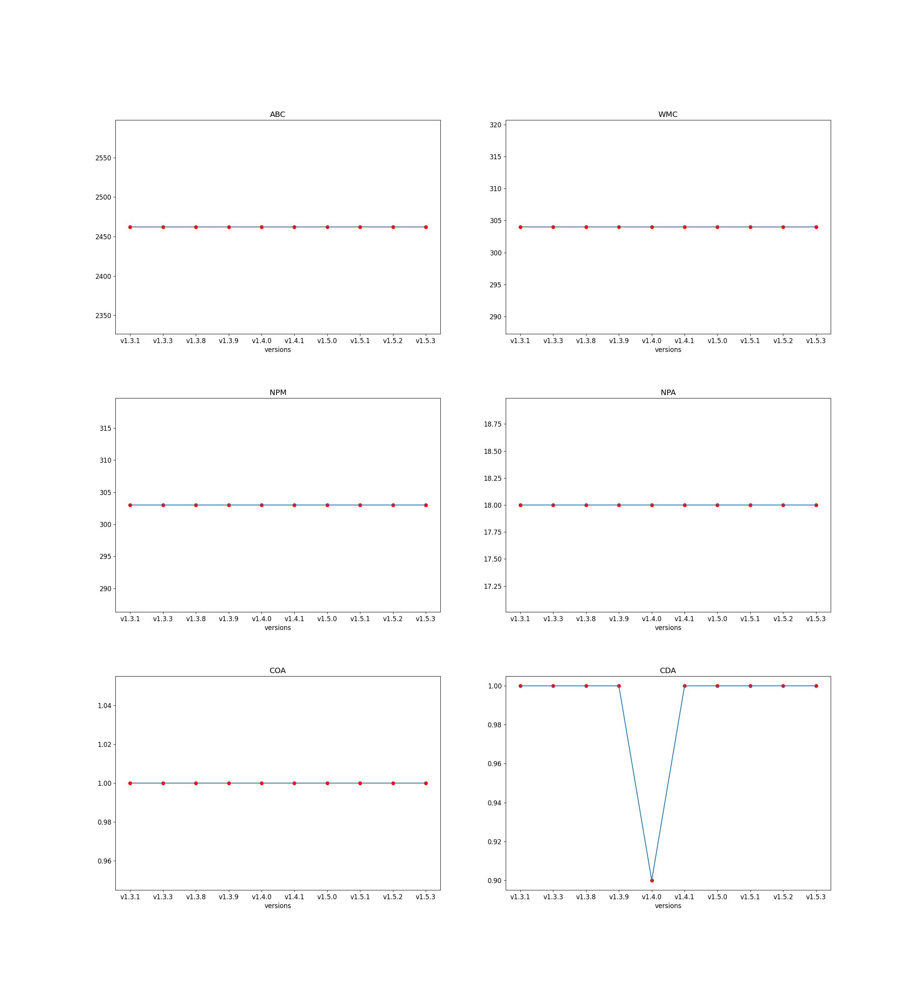

# time-analysis

## Graphs
- [FastCSV average](#fastcsv-average)
- [FastCSV maximum](#fastcsv-maximum)
- [java-jwt average](#java-jwt-average)
- [java-jwt maximum](#java-jwt-maximum)
- [jsoup average](#jsoup-average)
- [jsoup maximum](#jsoup-maximum)
- [Java-WebSocket average](#java-websocket-average)
- [Java-WebSocket maximum](#java-websocket-maximum)

### FastCSV average

### FastCSV maximum

### java-jwt average

### java-jwt maximum

### jsoup average

### jsoup maximum

### Java-WebSocket average

### Java-WebSocket maximum

